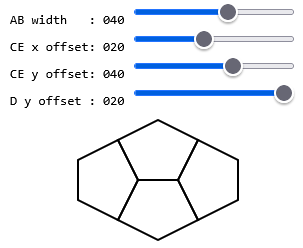

# Pentagon Tile

This project is an interactive HTML5 Canvas tool to explore and fine-tune the geometry of a **pentagon**.

Using sliders, you can adjust:

- **AB width**
- **CE x offset**
- **CE y offset**
- **D y offset**

The canvas redraws in real time, showing how these parameters affect the pentagon shape and how multiple rotated copies tile together.

## Tech

- HTML
- CSS
- Vanilla JavaScript
- Canvas 2D API
